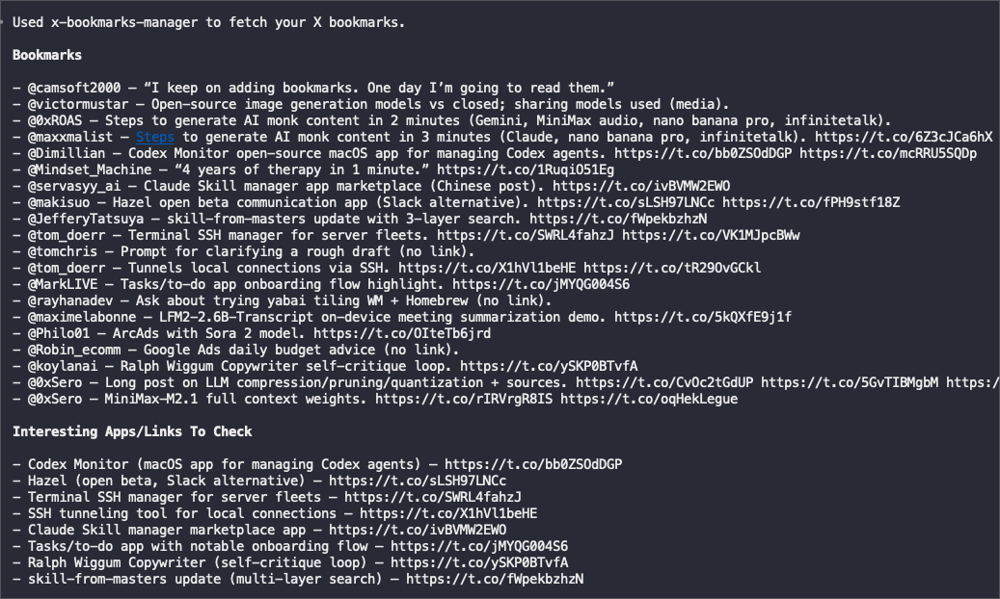

# X Bookmarks Manager (Agent skill)

Read X/Twitter bookmarks via the `bird` CLI. The agent validates the active account, fetches bookmarks as JSON, then summarizes or filters them for you.

## What it does
- Verifies the active X account with `bird whoami` before pulling data.
- Fetches bookmarks as JSON via `bird bookmarks --json`.
- Blocks if the account does not match `BIRD_EXPECTED_USER`.
- Supports an optional `BIRD_COOKIE_SOURCE` for auth configuration.

## Sample output

## How it works (agent-driven)
- You ask in natural language (for example: "show my X bookmarks" or "summarize the apps I saved").
- The agent ensures `bird` is installed (via `scripts/setup.sh`) and `BIRD_EXPECTED_USER` is set.
- The agent runs `scripts/x-bookmarks` to validate the account and print JSON.
- The agent summarizes or filters the JSON for the requested output.

## Requirements
- An authenticated X/Twitter session for `bird` (run `bird login` if needed).
- Node.js + npm for first-time install of `@steipete/bird` (unless you set `BIRD_BIN`).
- Network access to fetch bookmarks and install dependencies.

## How to use
Example prompts:
- "Show my X bookmarks"
- "Summarize interesting apps from my bookmarks"
- "Find bookmarks about SSH or infra tools"
- "Export my bookmarks as JSON"

## Manual CLI (optional)
If installed under a project at `.codex/skills/x-bookmarks-manager`:
- `bash .codex/skills/x-bookmarks-manager/scripts/setup.sh`
- `BIRD_EXPECTED_USER="@yourhandle" bash .codex/skills/x-bookmarks-manager/scripts/x-bookmarks`

From this repo root:
- `bash scripts/setup.sh`
- `BIRD_EXPECTED_USER="@yourhandle" bash scripts/x-bookmarks`

## Where config/state is stored
Skill uses ideas from https://github.com/eugenepyvovarov/skill-boilerplate-skill to store config/data in common location for skills in the current project folder.

This skill keeps all mutable state in a deterministic, git-ignorable location under your project root.

- `project_root`: the root of your project/repository (the place you would typically put your `.gitignore`).
- Skill data dir: `<project_root>/.skills-data/x-bookmarks-manager/`
  - Env file: `.skills-data/x-bookmarks-manager/.env`
  - Local tools: `.skills-data/x-bookmarks-manager/bin/` (prepend to `PATH` when needed)
  - Dependencies: `.skills-data/x-bookmarks-manager/venv/`
  - Logs/cache/tmp: `.skills-data/x-bookmarks-manager/logs/`, `cache/`, `tmp/`

## Placement
This skill expects to live under `<project_root>/.codex/skills/x-bookmarks-manager` so it can resolve the host project root and store `.skills-data` alongside the project. If you run it elsewhere, update the `PROJECT_ROOT` logic in `scripts/x-bookmarks` and `scripts/setup.sh`.

## Safety (isolation)
By default, automation lives in `scripts/` and should only write to:
- this repo folder (the skill root), and
- `<project_root>/.skills-data/x-bookmarks-manager/`

The skill is read-only with respect to X; it only reads bookmarks.

## CLI reference (optional)
- Fetch bookmarks: `bash scripts/x-bookmarks`
- Setup: `bash scripts/setup.sh`
- Underlying commands: `bird whoami --json`, `bird bookmarks --json`

## Attribution
Uses the `bird` CLI by https://github.com/steipete/bird.
